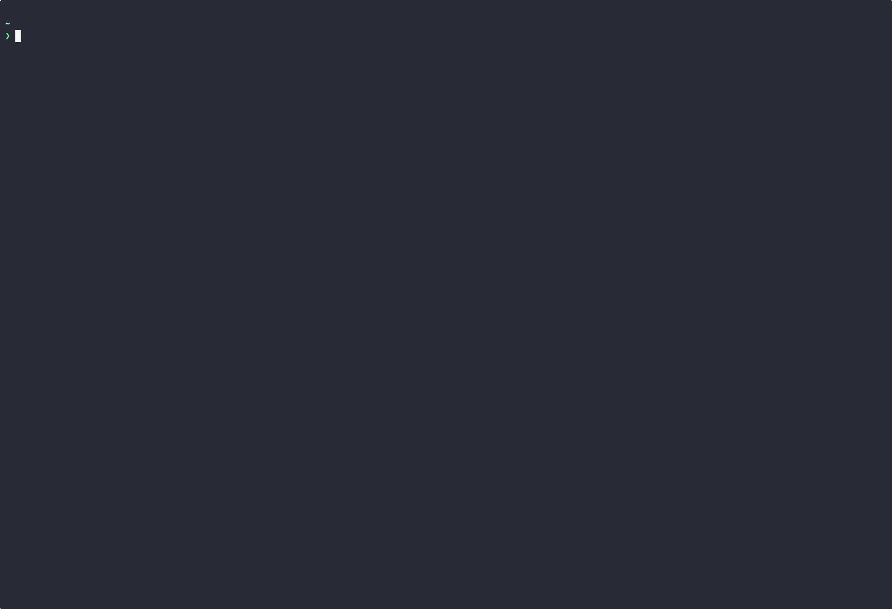

# Xray

[](https://crates.io/crates/xray-tui)

<p align="center">
  
</p>

<p align="center">
  <i>A blazing fast Docker (or any OCI-compliant) image layer inspector!</i>
</p>

> Xray helps developers understand and optimize container images by visualizing layers and their contents using a minimalistic but powerful UI with performance in mind.

## Features



- 🛠️ Supports **Vim motions**
- 📌 Relatively **small memory footprint** (~80Mb for an 8Gb image)
- 🗒️ Supports **path filtering** (with full *RegEx* support)
- ⛓️ Supports **size-based filtering**
- 🚀 Fast startup times due to optimized image parsing
- 🏡 Convenient and minimalistic UI
- 📦 Works with **any OCI-compliant container image**
- ⚙️ No needless re-rendering of the UI: `xray` values your CPU cycles

## Disclaimer

This is essentially a beta release at this point, so don't hesitate to open an issue if you find any bugs while using it 🍀

## Installation

### From source

> ⚠️ Requires the nightly compiler

```bash
# If Rust nightly wasn't installed before
$ rustup toolchain install nightly
$ cargo +nightly install --locked xray-tui
```

### From the [AUR](https://aur.archlinux.org/packages/xray-oci-git)

```bash
paru -Sy xray-oci-git
```

## Motivation

Everyone who had to work with container images before knows about the [dive](https://github.com/wagoodman/dive) tool. It's a great tool, but it doesn't work that well for bigger images, especially the ones that are 5 GB or more in size.

Xray fixes this problem by carefully managing available resources and applying a set of small but important optimizations. All these things make Xray far more responsive when used with large images, while still providing the core functionality and being easy to use.

## Usage

```bash
$ xray --help
Usage: xray [OPTIONS] <IMAGE>

Arguments:
  <IMAGE>


Options:
  -p, --config-path <CONFIG_PATH>
          Override the config directory location.

          Default: $HOME/.xray

  -d, --docker
          Force image resolution using Docker

  -f, --fs
          Force image resolution using a tarred image

  -h, --help
          Print help (see a summary with '-h')

  -V, --version
          Print version
```

### Using the app

To inspect an image use:

```bash
xray <IMAGE>[:tag]
```

`xray` will try to resolve the provided image using the default resolution order:

1. Look for a [tarred repository](https://docs.docker.com/reference/cli/docker/image/save/) with image locally (treating the provided argument as a **path**)
2. Try to resolve the image using Docker

> 💡 Please refer to `xray --help` if you want to force a specific image resolver.

### Keybindings

> 💡 You can always use the *help popup* available by pressing `/` to get the *contextualized help* for the currently active pane.

#### Navigation

| Key Sequence | Action                                                    |
| ------------ | --------------------------------------------------------- |
| `1`          | select  the "Image Information" pane                      |
| `2`          | select the "Layer Information" pane                       |
| `3`          | select the "Layers" pane                                  |
| `4`          | select the "Layer Changes" pane                           |
| `Left`, `h`  | scroll the current entry left (**if supported by pane**)  |
| `Down`, `j`  | select the next entry in the current pane                 |
| `Up`, `k`    | select the previous entry in the current pane             |
| `Right`, `l` | scroll the current entry right (**if supported by pane**) |
| `Tab`        | cycle through the panes: next pane                        |
| `Shift-Tab`  | cycle through the panes: previous pane                    |
| `q`          | exit the app                                              |

#### Actions

| Key Sequence     | Action                                                                        |
| ---------------- | ----------------------------------------------------------------------------- |
| `Enter`, `Space` | toggle the selected directory (**inside the "Layer Changes" pane**)           |
| `Ctrl-f`         | open the filter popup (**inside the "Layer Changes" pane**)                   |
| `y`              | copy the currently selected value to the clipboard (**if supported by pane**) |
| `/`              | open/close the help popup                                                     |
| `c`              | toggle "show only changed files" filter (**inside the "Layer Changes" pane**) |

## Limitations

- Opaque whiteouts are not handled properly
- Some panes are missing the vertical/horizontal scroll feature, which may cause issues in certain contexts

## Planned Improvements

> This section contains additional good-to-have things that I plan to add besides fixing everything in the [Limitations](#limitations) section.

- Reduce the memory footprint further
- Add unit and fuzz tests
- Improve the scrolling behaviour in the "Layer Changes" tab
- Add more installation options
- Add configurable keybindings
- Add layer caching

## Copyright and License

Xray is distributed under the GNU General Public License version 3. See [COPYING](./COPYING) for full details.
